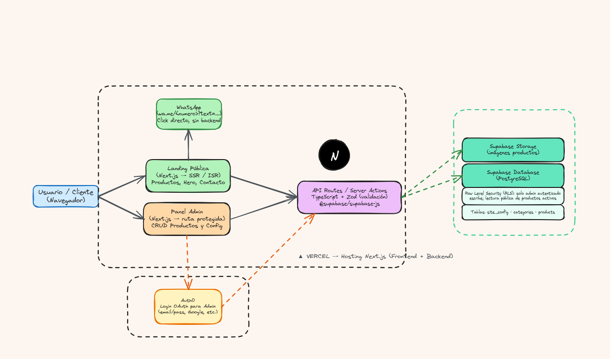

# 🥩 CarnesApp

Landing page parametrizable para carnicerías, con panel de administración para gestionar productos, imágenes y contacto directo por WhatsApp.


---

## ✨ Características

- 🛒 **Catálogo de productos** parametrizable — nombre, descripción, precio, unidad, categoría e imagen
- 🖼️ **Gestión de imágenes** vía Supabase Storage
- 📱 **Contacto directo por WhatsApp** — botón flotante general y "Consultar por este producto" en cada ítem del catálogo
- 🧾 **Pedidos por WhatsApp** — el cliente arma su pedido en la web, con cantidades por peso o unidad e indicaciones por producto ("en bistec", "molida"), y lo envía como mensaje
- 🔎 **Búsqueda y paginación** del catálogo, sin distinguir tildes ni mayúsculas ("salmon" encuentra "Salmón")
- 🏷️ **Promociones** con precio rebajado y vigencia programada, y productos marcados como **agotados**
- 📍 **Ubicación del local** con mapa de Google Maps y enlace para llegar; el administrador la elige en un mapa interactivo
- 🕒 **Horario de atención** con indicador "Abierto ahora / Cerrado"
- 🔐 **Panel de administración** protegido con Auth0 (login OAuth)
- ⚙️ **Configuración del negocio** editable sin tocar código: nombre, logo, teléfono, horario, redes sociales, color principal
- 🗄️ **Base de datos Postgres administrada** (Supabase) con Row Level Security (RLS)
- ⚡ Renderizado híbrido (SSR / ISR) para carga rápida y contenido siempre actualizado

## 🏗️ Arquitectura



El proyecto corre como una app Next.js desplegada en Vercel, que se conecta a tres servicios externos:

- **Auth0** — autenticación del panel admin
- **Supabase** — base de datos PostgreSQL + almacenamiento de imágenes
- **WhatsApp (`wa.me`)** — contacto directo desde el cliente, sin pasar por el backend

## 🧱 Stack técnico

| Capa | Tecnología |
|---|---|
| Frontend | Next.js (App Router) + TypeScript |
| Estilos | Tailwind CSS |
| Backend | Next.js Route Handlers / Server Actions |
| Validación | Zod |
| Base de datos | Supabase (PostgreSQL) |
| Storage de imágenes | Supabase Storage |
| Autenticación | Auth0 |
| Deploy | Vercel |

## 🚀 Getting Started

### Requisitos previos

- Node.js 20.9+ (requerido por Next.js 16)
- Cuenta en [Supabase](https://supabase.com)
- Cuenta en [Auth0](https://auth0.com)

### Instalación

```bash
git clone https://github.com/sagodev12/CarnesApp.git
cd CarnesApp
npm install
```

### Variables de entorno

Crea un archivo `.env.local` en la raíz del proyecto:

```bash
# Supabase
NEXT_PUBLIC_SUPABASE_URL=
NEXT_PUBLIC_SUPABASE_ANON_KEY=
SUPABASE_SERVICE_ROLE_KEY=

# Auth0
AUTH0_SECRET=
AUTH0_BASE_URL=http://localhost:3000
AUTH0_ISSUER_BASE_URL=
AUTH0_CLIENT_ID=
AUTH0_CLIENT_SECRET=
```

### Correr en desarrollo

```bash
npm run dev
```

Abre [http://localhost:3000](http://localhost:3000).

### Correr las pruebas

```bash
npm test
```

Pruebas unitarias con Vitest para la lógica de pedidos, promociones, búsqueda, horarios, validaciones y la protección del panel de administración.

## 📁 Estructura del proyecto

```
CarnesApp/
├── src/
│   ├── app/
│   │   ├── (public)/          # Landing pública
│   │   ├── admin/             # Panel de administración (protegido)
│   │   └── api/                # Route Handlers
│   ├── components/
│   │   ├── public/
│   │   └── admin/
│   ├── lib/                    # Clientes Supabase, Auth0, helpers WhatsApp
│   └── types/
├── supabase/                   # Políticas RLS y scripts SQL
├── docs/
│   └── architecture/           # Diagrama de arquitectura
└── ...
```

## 🗺️ Roadmap

- [ ] Múltiples imágenes por producto
- [ ] Panel de estadísticas (productos más consultados por WhatsApp)
- [ ] Soporte multi-sucursal
- [ ] Modo multi-tenant (una instancia para varias carnicerías)

## 📄 Licencia

MIT
